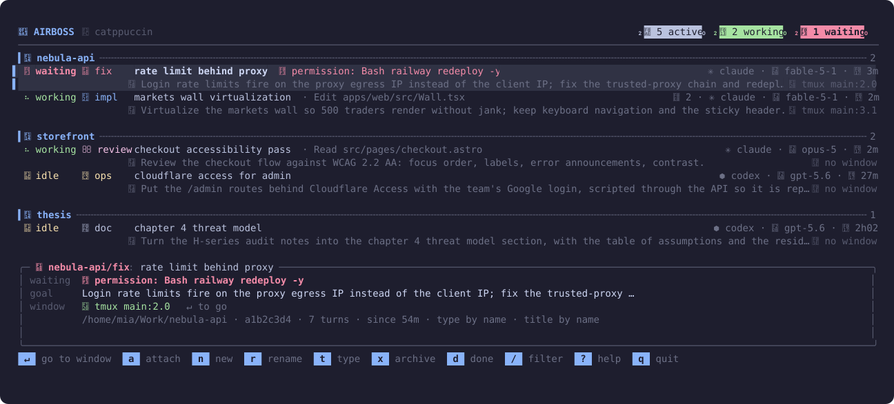

<h1 align="center">󱚣 airboss</h1>

<p align="center"><b>The agent orchestrator for people who never leave the terminal.</b><br>
Every Claude Code and Codex CLI session on your machine on one screen — grouped by project and task, telling you which one is waiting on you, launching new ones, and jumping to the right terminal window with <kbd>Enter</kbd>. No Electron, no web UI, no account.</p>

<p align="center"></p>

<p align="center">
<code>Go · Bubble Tea · ~1.5k lines</code> · <code>one binary + a handful of shell scripts</code> · <code>Linux: Hyprland · Sway</code> · <code>macOS: iTerm2 · Terminal.app</code> · <code>tmux</code> · <code>everything configurable in one TOML</code>
</p>

---

## Why

If your whole workflow is terminals, the agent-orchestrator market has nothing for you. Every tool wants to become the place you work: an Electron shell with its own embedded terminals, a web kanban, a Mac app that owns your worktrees. You already have a window manager, a multiplexer, a font you picked, a theme you spent an evening on — and eight terminals, each with an agent in it.

airboss is the missing control plane for exactly that setup. It does not replace your terminal, launch your agents inside a sandbox, or ask you to move your work. It reads the state the CLIs already publish through their own hooks, puts it on one screen, and gets you back to the terminal that needs you:

- **State per session**, from the agents' own hooks: `working`, `waiting` (a permission prompt, a question, or a turn that ended and nobody came back within 60 s), `idle`, `error`, `done`. Codex sessions started before hooks existed are picked up from their rollout files.
- **Grouped by project, typed by task** — `impl`, `plan`, `fix`, `review`, `ops`, `doc`. Titles follow `project/type: description`; a background classifier names the ones you did not.
- **<kbd>Enter</kbd> goes to the terminal.** On Linux airboss finds the compositor window that owns the agent process (walking `/proc` ancestors, tmux clients or window titles) and focuses it on Hyprland or Sway. On macOS it matches the session's tty — its tmux client's when it runs in a pane — against the tabs iTerm2 and Terminal.app expose over AppleScript, and raises that exact tab. Either way it then selects the tmux window and pane.
- **Alerts that reach you**, at the desk or away from it: desktop notifications, [ntfy](https://ntfy.sh) to your phone, Telegram, or a script of your own — and you choose which transitions are worth the interruption.
- **It looks like the rest of your desktop.** Palette from the active Omarchy theme, nine built-ins, three icon sets, every glyph and colour overridable.
- **Nothing is load-bearing.** Cards are plain JSON files; `cat ~/.local/state/agent-board/sessions/*.json` is a valid dashboard too. Turn any part of airboss off and the rest keeps working.

## Install

Requirements: Linux or macOS, Go ≥ 1.22, `jq`. Optional: `tmux`, `curl` (phone alerts), a [Nerd Font](https://www.nerdfonts.com/).

```bash
git clone https://github.com/TraceRt314/airboss.git ~/airboss && cd ~/airboss
./install.sh --hooks      # builds airboss-tui, links scripts into ~/.local/bin,
                          # installs the 5 s sync timer, registers the hooks
airboss
```

`--hooks` merges `hooks/claude-hooks.json` into `~/.claude/settings.json` (backup kept) and writes `~/.codex/hooks.json` plus a `notify` line in `~/.codex/config.toml`. Both merges replace only airboss's own entries, so hooks another tool registered survive. Codex asks you once to trust the hooks with `/hooks`. Without `--hooks` nothing outside `~/.local/bin`, `~/.config/airboss` and the timer unit is touched.

Bind it to a key. Omarchy / Hyprland (`~/.config/hypr/bindings.lua`):

```lua
o.bind("SUPER + F1", "airboss", { tui = "airboss", focus = true })
```

Sway: `bindsym $mod+F1 exec foot -a airboss airboss`.

### macOS

Everything works except what the platform does not have: there is no compositor, so window focus goes through AppleScript, and the 5 s reconcile runs under launchd instead of a systemd timer. The installer picks all of this up from `uname`; there is nothing extra to do.

| | Linux | macOS |
|---|---|---|
| periodic sync | systemd user timer | launchd agent `com.airboss.sync`, running `agent-board-sync --loop 5` (launchd will not respawn a job more often than every 10 s, so one long-lived process is what gets the real 5 s cadence) |
| desktop notifications | `notify-send` | `terminal-notifier`, else `osascript` |
| jump to the tab | Hyprland / Sway, by pid ancestry | iTerm2 / Terminal.app, by tty |
| other terminals | any Wayland client | Ghostty, kitty, WezTerm, Alacritty, Warp: raised as an app, no per-tab jump (they do not script their tabs) |

Optional but recommended:

```bash
brew install terminal-notifier   # clickable, grouped notifications instead of osascript's
```

The first notification asks for permission — allow it for iTerm2 (or for `terminal-notifier`) in System Settings → Notifications, or nothing will ever show up.

Bind it to a key in iTerm2: Settings → Keys → Key Bindings → `+`, action **Send Text**, `airboss\n`. Inside tmux, `airboss` opens in its own `airboss` window, so the binding works from any pane.

Check that window resolution works on your setup:

```bash
airboss-tui windows          # every tab airboss sees, and the one each session maps to
airboss-focus --dry-run PID  # where a given pid would take you, without jumping
```

The scripts are written for bash 3.2, the one macOS ships, so no Homebrew bash is needed.

## Keys

| key | action |
|---|---|
| <kbd>↵</kbd> <kbd>l</kbd> <kbd>→</kbd> | go to the session's window (compositor + tmux) |
| <kbd>a</kbd> | attach a background session or resume a finished one |
| <kbd>n</kbd> | new Claude session in a tmux window (`project/type: description`) |
| <kbd>r</kbd> | rename (the new title is pushed to Claude's session list and `/resume`) |
| <kbd>t</kbd> | cycle the task type |
| <kbd>x</kbd> | archive the card |
| <kbd>d</kbd> | show / hide finished sessions |
| <kbd>/</kbd> | filter by text |
| <kbd>s</kbd> | sync now |
| <kbd>?</kbd> | help |

## Configure everything

One file — `~/.config/airboss/config.toml`, created from [`config.example.toml`](config.example.toml) on install. Every key is optional and every section can be left out entirely. The Go binary is the only thing that parses it; the shell side reads the resolved values back through `airboss-tui config`, so there is one source of truth and no second config format to learn.

### Alerts: what interrupts you, and where

Pick the transitions worth an interruption, then pick where they land. Sinks combine, so the same event can buzz the desk and the phone.

```toml
[notify]
enabled = true
sinks = ["desktop", "ntfy"]   # desktop | ntfy | telegram | command

[notify.events]
waiting = true                # the agent needs an answer: permission, question,
                              #   or a turn that ended and nobody came back
error = true                  # the agent errored
turn_done = false             # every turn ending — noisy on a busy day
session_done = false          # the session closed
```

| sink | goes to | needs |
|---|---|---|
| `desktop` | `notify-send`, or `terminal-notifier` / `osascript` on macOS | nothing |
| `ntfy` | the [ntfy](https://ntfy.sh) app on your phone, or your own server | `[notify.ntfy].topic` |
| `telegram` | a Telegram bot message | `[notify.telegram].token` and `chat_id` |
| `command` | your own script | `[notify].command` |

**Phone alerts.** Install the ntfy app (Android / iOS), subscribe to a topic, put the same topic here. A `waiting` agent then reaches you anywhere — on the public server the topic name is the only secret, so pick one nobody will guess.

```toml
[notify.ntfy]
topic = "airboss-7f3a1c"
# url = "https://ntfy.example.com"        # your own server
# token = "env:NTFY_TOKEN"                # literal, env:VAR or file:~/path

[notify.telegram]
token = "file:~/.config/airboss/telegram.token"
chat_id = "123456789"
```

Tokens can be the literal value, `env:VAR` or `file:/path`, so a `config.toml` that lives in a dotfiles repo never holds the secret itself.

Anything else — a pager, a smart bulb, a webhook — is the `command` sink, called with the four arguments the notifier itself takes:

```toml
[notify]
sinks = ["desktop", "command"]
command = "~/.local/bin/my-pager"    # my-pager <urgency> <icon> <title> <body>
```

Network sinks are detached and time-limited, so a slow ntfy never holds up the hook that fired it, and one broken sink does not stop the others.

### Features: turn parts off

Everything is on by default. Each of these is independent — switch one off and the rest is unaffected.

```toml
[features]
classifier = true      # name untitled sessions with a small model in the background
window_focus = true    # resolve terminal windows and raise them with ↵
apply_title = true     # push the canonical title back into the CLI's session list
sync = true            # the 5 s reconcile pass
```

`classifier = false` if you name every session yourself or would rather not spend the tokens. `window_focus = false` on a setup airboss cannot resolve — <kbd>Enter</kbd> then falls back to the tmux pane. `apply_title = false` to keep airboss strictly read-only towards the CLIs. `sync = false` leaves the hooks as the only source, so sessions that predate them are not picked up and dead ones are not marked `done`.

### Looks

```toml
[theme]
source = "auto"             # auto (Omarchy if present, else builtin) | omarchy | builtin
name = "tokyo-night"        # catppuccin-mocha, catppuccin-latte, tokyo-night, gruvbox-dark,
                            #   nord, dracula, rose-pine, everforest, kanagawa
[theme.colors]
accent = "#ff79c6"          # any palette key: background, foreground, muted, red, green…

[icons]
set = "nerd"                # nerd | unicode | ascii
[icons.override]
claude = "\U000F06A9"       # Nerd Font glyphs as \u / \U escapes
waiting = ""

[ui]
title = "CONTROL TOWER"
lang = "en"                 # es | en (default: from $LANG)
show_goal = true            # the second line per session, with the goal and the window
details = true              # the detail box under the list
detail_lines = 5
border = "rounded"          # rounded | square | none
spinner = "dots"            # braille | dots | line | none
name_width = 44
tick_seconds = 2
```

`source = "auto"` means airboss follows whatever Omarchy theme is active, so it re-themes with the rest of your desktop and you never touch this section. `icons.set = "unicode"` or `"ascii"` for terminals without a Nerd Font — nothing in the layout depends on the glyphs.

**Icon keys:** `app claude codex waiting working idle done error goal window tmux nowindow sub model clock impl plan fix review ops doc project home go node python rust astro git theme filter sync active bell help bar sel rule chip_l chip_r`.

### Projects and task types

Colour, icon and display label per task type and per project. Project icons are auto-detected from `go.mod`, `package.json`, `pyproject.toml`, `Cargo.toml`, `astro.config.*` or `.git` unless you set one.

```toml
[types.fix]
icon = ""
color = "orange"
label = "bug"

[projects.nebula-api]
icon = ""
color = "blue"
label = "Nebula"
```

### Overriding it for one run

Flags beat the file: `airboss-tui -theme nord -icons unicode -lang en`, or `-config /path/to/other.toml`. Useful side commands:

```bash
airboss-tui config           # the resolved config, as shell assignments
airboss-tui color accent     # a palette colour, for tmux, starship or scripts
airboss-tui themes           # the built-ins
airboss-tui windows          # what airboss sees, and where each session maps
```

[`themes/`](themes/) holds each palette as TOML in the same format as Omarchy's `colors.toml`, so you can drop your own next to them.

## How it works

```
Claude Code hooks ─┐                        ┌─ airboss-tui       (this TUI)
Codex CLI hooks ───┼─▶ agent-event ─▶ state/ ┼─ tmux segment / starship
codex notify ──────┘         ▲               └─ airboss-notify ─▶ desktop · ntfy · telegram · you
                             │
systemd / launchd, 5 s ─▶ agent-board-sync   (claude agents --json, process table, Codex rollouts)
```

- `scripts/agent-event` receives every hook event from both CLIs on stdin, normalizes it into one JSON card per session under `~/.local/state/agent-board/sessions/`, sets the canonical title, and decides — from `[notify.events]` — which transitions are worth a notification.
- `scripts/airboss-notify` is the single dispatch point for those notifications, fanning each one out to the configured sinks.
- `scripts/agent-board-sync` reconciles the state with reality every five seconds: `claude agents --json` is authoritative for Claude; for Codex it finds live processes, reads the open rollout file to know whether a turn is in progress (`task_started` without `task_complete`), and marks dead sessions `done`. It runs under a lock and reads rollouts incrementally, so a 500 MB rollout costs nothing.
- `scripts/agent-title` asks a small model (Haiku, no hooks, no transcript) for a `type: description` for sessions you did not name. Your own `/rename` always wins.
- `airboss-tui` reads the cards, resolves each session's window and draws. It never writes to the agents; the only state it owns is the cards.

The `summary.json` next to the cards feeds a [tmux segment](scripts/airboss-tmux-segment) and can feed starship or waybar.

## Session naming

airboss expects `project/type: description`, e.g. `nebula-api/impl: rate limiter`. Set it with `claude --name "…"`, `/rename` in either CLI, or <kbd>r</kbd> here. A free-text `/rename` is normalized to the format; untitled sessions get a provisional title from the first prompt and a proper one from the classifier a few seconds later. The type drives the colour and grouping; a small launcher wrapper of your own can also map it to a model and effort profile (`claude --name "$1/$2: $3" --model ...`).

## Compared with other agent controllers

Checked against each project's repository or site on 2026-09-07. `?` means the project does not document it.

| | kind | agents | Linux | license | cloud / account | waiting alert | jump to terminal | by project & task |
|---|---|---|---|---|---|---|---|---|
| **airboss** | TUI, Go | Claude Code, Codex | ✓ | MIT | none | ✓ desktop, ntfy, Telegram, own script | ✓ compositor window / tab + tmux pane | ✓ project / type |
| [Orca](https://github.com/stablyai/orca) | Electron GUI + mobile app | 30+ | ✓ | MIT | mobile pairing goes through a cloud relay | ✓ | ? (built-in terminals) | GitHub / Linear boards |
| [T3 Code](https://github.com/pingdotgg/t3code) | web + Electron + mobile | Codex, Claude Code, Cursor, OpenCode… | ✓ | MIT | local backend | ? | ? | ? |
| [agent-deck](https://github.com/asheshgoplani/agent-deck) | TUI on tmux | Claude Code, Codex, Gemini, Copilot… | ✓ | MIT | none | ✓ tmux status, Telegram/Slack | ✓ keys 1–9 to waiting sessions | ✓ declarative groups |
| [claude-squad](https://github.com/smtg-ai/claude-squad) | TUI, tmux + worktrees | Claude Code, Codex, Gemini, Aider | ✓ | AGPL-3.0 | none | – (`autoyes` instead) | attach to session | per session worktrees |
| [Conductor](https://www.conductor.build/) | native Mac app | Claude Code, Codex, Cursor, OpenCode | – | proprietary | ? | ? | ? | ✓ worktree per task |
| [Vibe Kanban](https://github.com/BloopAI/vibe-kanban) | web kanban (sunsetting) | 10+ | ✓ | Apache-2.0 | self-host or cloud | ? | ? | ✓ kanban issues |

What airboss does differently:

- **It watches, it does not own.** Orca, T3 Code, Conductor and claude-squad launch and own the agent processes, usually one worktree each. airboss attaches to the sessions you already started, in whatever terminal you like, and reads their state from the hooks the CLIs already expose. Nothing changes in how you work; there is just a window that knows.
- **It knows where the terminal is.** agent-deck jumps between tmux sessions; airboss resolves the actual window or tab that owns the agent process — Hyprland, Sway, iTerm2, Terminal.app — raises it, and then selects the tmux pane if there is one. Works for sessions outside tmux.
- **It types the work.** Sessions carry a task type that drives colour, grouping and, if you want, the model and effort profile at launch. A background classifier names untitled sessions.
- **Phone alerts without a cloud account.** Orca's mobile app pairs through a relay. airboss posts to an ntfy topic or a Telegram bot you own, only on the transitions you asked for, from your machine.
- **It is a desktop citizen, not an app.** One Go binary plus a handful of shell scripts, no Electron, no daemon beyond a 5-second timer, no account — and one TOML that changes the palette, the glyphs, the layout, the alerts and which subsystems run at all.

If you want a GUI with a phone app and dozens of agents, Orca is the mature choice. If you want the agents to run inside isolated worktrees with diff review, look at Conductor (Mac) or claude-squad. agent-deck is the closest cousin if your whole life is in tmux.

## Roadmap

Rough order. Open an issue if one of these matters to you, or send a PR.

- **More agents.** Gemini CLI, OpenCode and Copilot CLI expose hooks or session files comparable to Claude Code and Codex; each is a small adapter in `agent-event` plus a discovery rule in `agent-board-sync`.
- **Reply from the phone.** The alert tells you an agent is waiting; approving a permission prompt still means walking back to the desk. ntfy action buttons could answer the common yes/no case.
- **Cost per session.** Token and cost figures from the CLIs' own usage logs on each card, with a weekly budget line in the header and a warning when it is about to be exceeded.
- **Per-tab jumps in the other macOS terminals.** Ghostty, kitty, WezTerm and Alacritty are raised as an app today; kitty's remote control and `wezterm cli list` both expose a pane tty and would close the gap.
- **Waybar / status bar module.** A ready-made module fed by `summary.json`, in addition to the tmux segment.
- **Handoffs.** Show a session's last handoff note on its card and let <kbd>a</kbd> resume with it, so a finished session can be picked up hours later without re-reading the transcript.
- **Zellij and Kitty tabs** as pane backends besides tmux.

Not planned: running or sandboxing the agents, worktree management, a web UI. Other tools do that well; airboss stays the window that knows.

## Status

Built on Arch + Omarchy with Claude Code 2.1 and Codex CLI 0.150. Hyprland focus uses the Lua dispatcher of Hyprland ≥ 0.56 with the classic syntax as fallback.

macOS is supported from 26 (Tahoe), tested on iTerm2 with the system bash 3.2: `window_darwin.go` resolves tabs by tty through AppleScript, `scripts/lib-airboss.sh` fills in for `flock`, `setsid`, `timeout`, GNU `stat` and `/proc`, and the reconcile runs under launchd. Terminals that do not script their tabs can only be raised, not tab-selected. PRs welcome.

## License

MIT.
